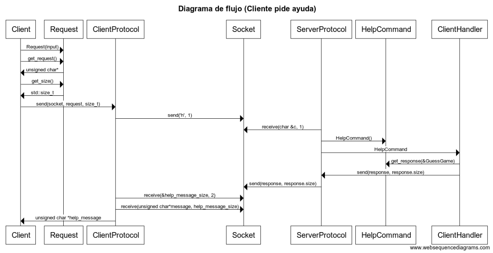
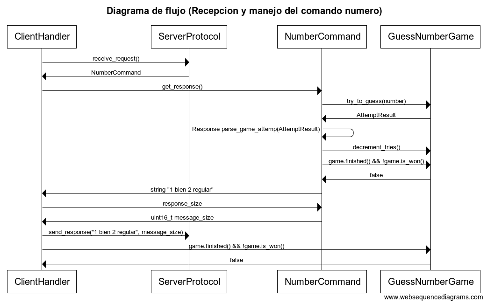

Padron: 98757

Nombre: Pinto Tomas Eduardo

Repositorio: https://github.com/pintotomas/tp3

##Descripcion

Aplicacion multi-cliente servidor donde los clientes tienen 10 intentos para adivinar un numero que es asignado al cliente una vez que este se conecta al servidor. Para el soporte de multiples clientes, se tiene la clase ClientListener del lado del servidor la cual una vez detecta que se conecto un nuevo cliente le asigna un numero y corre el juego en un nuevo thread (clase ClientHandler). Cada uno de los clientes se comunica con un unico ClientHandler respetando el protocolo especificado en el enunciado mediante sockets. Una vez que se cierra el servidor, se espera a todos los clientes que se encontraban jugando a que terminen su partida y luego se procede a liberar todos los recursos. 

##Diagramas

Aclaro que en este ultimo diagrama omiti algunas cosas de mas bajo nivel de Sockets para entender mas facilmente el comportamiento de la aplicacion y que sea mas legible. Ademas, en el ultimo diagrama el cliente recibe y espera la respuesta del servidor en cuanto envia el comando, no es secuencial como asi lo parece en el diagrama de flujo.

##Aclaraciones

- Utilize un namespace para el protocol en vez de una clase ya que no poseia atributos y ademas me parecio mas un agrupamiento de funciones relacionadas que un objeto.

- La respuesta del servidor se podria almacenar en un objeto Response para que cuando se llame a su destructor se elimine la memoria dinamica asignada asi aprovechando RAII, no llegue a hacerlo.
