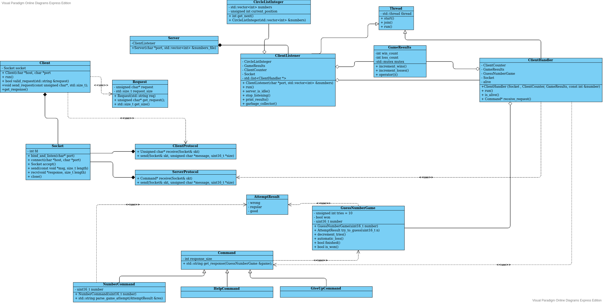

Padron: 98757

Nombre: Pinto Tomas Eduardo

Repositorio: https://github.com/pintotomas/tp3

##Descripcion

##Diagramas

Aclaro que en este ultimo diagrama omiti algunas cosas de mas bajo nivel de Sockets para entender mas facilmente el comportamiento de la aplicacion y que sea mas legible. Ademas, en el ultimo diagrama el cliente recibe y espera la respuesta del servidor en cuanto envia el comando, no es secuencial como asi lo parece en el diagrama de flujo.
